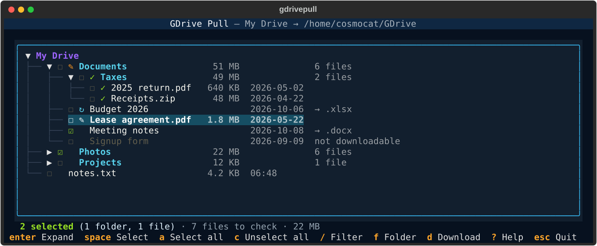

# GDrive Pull

GDrive Pull is an interactive, read-only Google Drive downloader for Linux and
other POSIX environments. You pick files and folders in a colored terminal
tree, review a preview of every local change, then confirm. Local edits are
never overwritten and nothing is deleted.



## Features

- Textual tree of your Drive in aligned columns: folders first, with their
  file count and size; files with their size, modification date and export
  format
- Marks from earlier downloads: ✓ up to date, ↻ changed on Drive, ✎ changed
  locally
- My Drive, Shared with me and every shared drive as views, switched with
  `Tab`
- Multi-selection of files and folders at any depth, across views; a
  selected folder includes everything below it
- `/` filter by name or path, `o` opens the item in Google Drive, `f` changes
  the download folder for the session, `?` shows the key help
- `--again` downloads the previous selection without the tree, replaying only
  the Drive changes since the last run; with `--yes` it runs unattended, for
  example from cron
- Fast loading: one batched API call per tree level, with retries on Drive
  rate limits; the plan reuses the loaded tree instead of listing it again
- Preview in the interface before any change: new, update, unchanged,
  conflict, removed from Drive, local only, skipped; `Esc` goes back to the
  tree to adjust the selection
- Atomic downloads through temporary `.part` files, removed if a download fails
  or is interrupted
- Google Docs, Sheets, Slides, Drawings and Apps Script exported to local
  formats
- Local change detection through checksums and a managed state file
- Files removed from Drive go to a recovery folder instead of being deleted
- Unknown local files and folders are preserved
- Drive shortcuts followed to their target files and folders
- Parallel downloads (4 at a time by default), with a progress bar, the
  amount downloaded and the speed, a ✓ / ✗ line per file and a final summary
- Compact browser sign-in with a clickable link, read-only Drive OAuth scope

## Repository contents

```text
GDRIVE/
├── LICENSE
├── README.md
├── gdrivepull.py
├── run-gdrivepull.sh
├── docs/
│   ├── make_screenshot.py
│   └── screenshot.svg
└── tests/
    └── test_gdrivepull.py
```

Runtime files such as OAuth credentials, tokens, and the virtual
environment are local files and must never be committed.

## Requirements

- Python 3.10 or newer
- A POSIX shell
- Python virtual environment support
- A Google Cloud project with the Google Drive API enabled
- OAuth 2.0 Desktop application credentials

The runner creates `.venv` and installs the required Python packages
automatically:

- `google-api-python-client`
- `google-auth`
- `google-auth-oauthlib`
- `textual`

## Google API setup

1. Create or select a project in the
   [Google Cloud Console](https://console.cloud.google.com/).
2. Enable the Google Drive API.
3. Configure the OAuth consent screen.
4. Create an OAuth client ID for a Desktop application.
5. Download the client file, rename it to `credentials.json`, and place it next
   to `gdrivepull.py`.

For additional details, see the
[Google Drive API Python quickstart](https://developers.google.com/workspace/drive/api/quickstart/python).

Never commit `credentials.json` or `token.json`.

## Installation

```bash
git clone https://github.com/C0sm0cats/GDRIVE.git
cd GDRIVE
chmod +x run-gdrivepull.sh
./run-gdrivepull.sh --help
```

The first run of the runner creates `.venv` and installs the dependencies.

## First run

```bash
./run-gdrivepull.sh
```

Files are downloaded into `~/GDrive` by default; use `--download-path PATH` for
another folder, or press `F` in the tree to change it for the session. The
folder is created if it does not exist. It must be:

- new;
- empty; or
- an existing GDrive Pull folder containing
  `.gdrivepull-managed-state.json`.

A non-empty folder without that state file is refused to prevent accidental
adoption or overwriting of unrelated data. The managed state stays inside the
download folder.

GDrive Pull then signs in to Google Drive. Your browser opens the Google
sign-in page; if it does not, the terminal shows a clickable link. The session
is kept in `token.json` and renewed automatically; when it has expired or been
revoked, the browser sign-in comes back.

## Options

| Option | Effect |
| --- | --- |
| `--download-path PATH` | Download folder (default: `~/GDrive`); new, empty or already managed |
| `--folder-id ID` | Browse this Drive folder instead of the root of My Drive |
| `--again` | Download the previous selection again, without the tree |
| `--yes` | Apply the preview without asking for confirmation |
| `--jobs N` | Files downloaded at the same time, 1 to 16 (default: 4) |
| `--verbose` | Show sign-in, token and API details, and list unchanged items in the preview |

## Interactive selector

The tree supports keyboard and mouse navigation. Press `?` for the same key
help, or run `./run-gdrivepull.sh --help`.

| Key | Action |
| --- | --- |
| `Up` / `Down` | Move through the tree |
| `Tab` / `Shift+Tab` | Next / previous view: My Drive, Shared with me, each shared drive |
| `Left` / `Right` | Collapse / expand a folder, or go to the parent folder / first child |
| `Enter` | Expand or collapse a folder |
| `Space` | Select or unselect an item |
| `A` | Select all, or unselect all when everything is already selected (only the matching items while a filter is active) |
| `C` | Unselect everything, including items hidden by the filter |
| `E` | Expand or collapse everything below the cursor |
| `/` | Filter by name or path: `Enter` keeps the filter, `Esc` clears it |
| `O` | Open the item in Google Drive |
| `F` | Change the download folder for this session: pick a parent directory, name the folder, `Ctrl+S` to apply, `Esc` to cancel |
| `D` | Compare with the download folder and show the preview |
| `?` | Key help |
| `Q` / `Esc` | Quit |

Folders show their number of files and their total size; files show their size,
their modification date (time only for today), and the local format of
Google-native files (`→ .docx`). These details are aligned in columns. Items that cannot be downloaded, such as Google
Forms, are greyed out. Selecting a parent folder includes its complete subtree
and replaces the child selections. The line under the tree counts the selected
items, the files they contain and their size.

A mark before the name shows what earlier downloads left in the destination,
read from the managed state without hashing any file:

| Mark | Meaning |
| --- | --- |
| `✓` | Downloaded and up to date (for a folder: every file in it) |
| `↻` | Changed on Drive since the download, or a folder with new files |
| `✎` | Changed locally since the download; the preview will keep it as a conflict |

Changing the folder with `F` updates the marks for the new destination.

### Views

`Tab` switches between My Drive, Shared with me (the items others shared with
you) and each shared drive you are a member of. A view is loaded the first time
it is shown; the tabs show how many items are selected in each. Selections are
kept across views and downloaded together:

```text
<download folder>/                     My Drive
<download folder>/Shared with me/      Shared with me
<download folder>/Shared drives/Team/  the shared drive "Team"
```

With `--folder-id`, only that folder is shown.

The filter keeps the matching items, their parent folders, and everything
below a matching folder. Selections hidden by the filter are kept.

## Preview and synchronization behavior

`D` compares the selection with the download folder and opens the preview:
the plan, a summary by status, and notes about conflicts and recovery.
Nothing has changed on disk yet.

| Key | Action |
| --- | --- |
| `Y` | Download |
| `V` | Show the changes (default), everything, or one status at a time |
| `Esc` / `N` | Back to the tree, selection kept |

When nothing needs to change, `Y` only saves the state. With `--yes`, the
preview is printed and applied without asking.

| Status | Meaning | Action |
| --- | --- | --- |
| `new` | The item does not exist locally | Download or create |
| `update` | Drive changed and the local copy still matches the previous state | Replace atomically |
| `unchanged` | Drive and local content match | Skip |
| `conflict` | Local content changed or cannot be matched safely | Preserve and skip |
| `removed from Drive` | A tracked, unchanged local file was removed from Drive | Move to recovery |
| `local only` | The local item is unknown to GDrive Pull | Preserve and skip |
| `skipped` | The Drive format is unsupported, or a shortcut loops back to a parent folder | Skip |

Tracked files removed from Drive are moved to:

```text
<managed-destination>/.gdrivepull-recovery/<timestamp>/
```

GDrive Pull never permanently deletes local content.

Files are downloaded in parallel (`--jobs`, 4 by default), each thread with its
own Drive connection. The progress bar shows the files done, the amount
downloaded and the speed, with one line per file. If a download fails, the
file keeps its previous content and the run ends with an error count. The state
is saved even after `Ctrl+C`, so the next run picks up where it stopped.

## Downloading the same selection again

Each confirmed run stores its selection in the managed state of the
destination. To download it again without the tree:

```bash
./run-gdrivepull.sh --again          # preview, then confirm
./run-gdrivepull.sh --again --yes    # no prompt, e.g. from cron
```

Each run also saves the folder listings it used and a Drive changes token in
`.gdrivepull-remote-cache.json`, in the download folder. `--again` replays the
Drive changes since then instead of listing every folder again, so it stays fast
on a large Drive; if the token has expired, the folders are listed again.

Selected items are looked up again on Drive, so renamed or updated files are
picked up. When a whole view was selected (every item at its top level), new
items in it are downloaded too. A selected item that is no longer on Drive is
reported, and its local files are handled like other files removed from Drive.

`--again` shows the same preview; with `--yes`, or without a terminal, it is
printed instead.

## Google-native file exports

Google-native files are exported as follows:

| Drive format | Local format |
| --- | --- |
| Google Docs | `.docx` |
| Google Sheets | `.xlsx` |
| Google Slides | `.pptx` |
| Google Drawings | `.pdf` |
| Google Apps Script | `.json` |

## Optional Drive folder

By default, the selector displays the root of My Drive. An explicit Drive folder
ID can be used as the remote root:

```bash
./run-gdrivepull.sh --folder-id DRIVE_FOLDER_ID
```

The folder ID is the last part of the folder URL in Google Drive.

## Local files

These files and directories are used or created locally and must not be
published:

```text
.venv/
credentials.json
token.json
```

The download folder contains:

```text
.gdrivepull-managed-state.json
.gdrivepull-remote-cache.json
```

The state file also keeps the last selection, for `--again`.

The `.gdrivepull-recovery/` directory is created only when tracked local
content removed from Drive needs to be preserved.

## Troubleshooting

- **Missing `credentials.json`**: GDrive Pull says where to put it; see
  [Google API setup](#google-api-setup).
- **Sign-in keeps failing**: remove `token.json` and run again.
- **A file stays in `conflict`**: it was changed locally or already existed
  with different content. Move or rename the local copy, then run again.
- **More details**: run with `--verbose`.

## Tests

```bash
.venv/bin/python -m unittest discover -s tests
```

The README screenshot is generated from the real selector with demo files:

```bash
.venv/bin/python docs/make_screenshot.py
```

## License

This project is licensed under the terms of the [LICENSE](LICENSE) file.

## Activity


